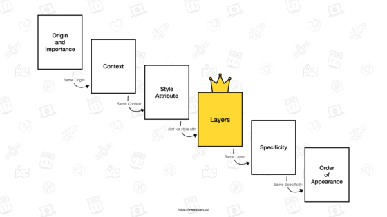

# 2022 CSS

2022 CSS 소개, 2022 CSS가 아닌 것도 일부 다룸.

## [데모](https://codesquad-cola.github.io/seminar-2022css)

- chrome canary 버전으로 실행해야만 적용되는 css가 있음.
- scope는 지원하는 브라우저가 없어서 데모 작동 안함.

<br />

# contain

이후에 다룰 container query의 사양이 css containment에 포함된다고 한다.

contain을 선언한 DOM요소는 다른 DOM요소와 분리되며, 브라우저에게 이를 알린다.

장점: 브라우저가 렌더링 과정에서 레이아웃, 스타일, 페인트 등 계산을 할 때 전체 DOM을 검사하지 않고(독립된 DOM은 불필요한 계산이 들어가지 않는다) 일부에서만 계산하여 성능상 이점이 생김. 규모가 큰 웹페이지에서 contain을 잘 활용하면 성능 향상이 매우 뚜렷하게 나타난다고 한다.

요약: 브라우저가 어떤 DOM요소가 독립적이라는 것을 알면 렌더링을 최적화할 수 있고, 다른 DOM요소와 독립되어 있음을 나타내는데 사용하는 css프로퍼티가 contain이다.

```css
div {
  contain: none; /* 기본값 */
  contain: size; /* 요소의 크기가 자손에 영향받지 않음 */
  contain: layout; /* 요소 외부에서 요소 내부의 레이아웃 영향 줄 수 없고, 내부에서 외부로 영향을 줄 수 없음. */
  contain: paint; /* 요소의 자손이 요소 범위 밖으로 나가는 경우 paint하지 않음. */
  /* containing block, block format context, stacking context */
}
```

- containment의 목적이 언급되어 있음.  
  https://developer.mozilla.org/en-US/docs/Web/CSS/CSS_Containment

- contain의 용례가 나와있음.  
  https://developer.mozilla.org/en-US/docs/Web/CSS/contain

<br />

# container-query

반응형 컴포넌트를 디자인할 때 viewport size를 기준으로 하는게 아닌, container의 사이즈를 기준으로 레이아웃, 스타일 등 변경 가능.

container query를 사용한다면 동일한 컨텐츠를 갖는 컴포넌트를 사이즈별로 여러개 정의할 필요가 없다. 하나만 정의해놓고 width값만 바꿔줌으로써 대응이 가능하기 때문이다.

https://developer.mozilla.org/en-US/docs/Web/CSS/CSS_Container_Queries

<br />

# cascade layer

CSS의 선언은 나중에 선언할 수록, 선택자가 더 구체적일수록 우선순위가 높다.

그런데 cascade layer를 사용하면 layer단위로 우선순위를 지정해주는 것이 가능하고, 앞서 말한 우선순위 규칙들보다 레이어를 적용하여 선언한 css가 더 높은 우선순위를 가진다.



cascade layer 사용에 있어서 알아두면 좋은 점은 다음과 같다.

나중에 선언한 layer가 우선순위가 높다. (!important는 layer상관없이 우선순위 제일 높음)

CSS파일을 import하면서 layer를 선언할 수 있다.

https://css-tricks.com/cascade-layers/

https://developer.mozilla.org/en-US/docs/Web/CSS/@layer

<br />

# scope

특정 범위에만 css선언을 할 수 있다. 아직은 지원하는 브라우저가 거의 없음.

```css
/* .box1에 있는 .depth-1에만 css 적용 */
@scope (.box1) {
  .depth-1 {
    background-color: red;
  }
}

/* .box1부터 .box2 사이에 있는 .depth-2에만 css 적용 */
@scope (.box1) to (.box2) {
  .depth-2 {
    background-color: blue;
  }
}
```

<br />

# nesting

&로 상위스타일을 선택할 수 있으며 &는 항상 처음에 와야한다.

@nest를 선언하지 않는다면 &는 가장 앞에만 올 수 있다. (아래의 첫 번째 예시)  
@nest 선언시 &는 어디에든 올 수 있다. (아래의 두 번째 예시)

```css
.box1 {
  color: blue;

  & > .box2 {
    /* .box1 > .box2 */
    color: red;
  }
}

.box1 {
  color: blue;

  @nest .parent > & > .box2 {
    /* .parent > .box1 > .box2*/
    color: red;
  }
}
```

https://www.w3.org/TR/css-nesting-1/#direct

<br />

# accent-color

특정 요소에 색을 줄 수 있다.

MDN에서는 타입 어트리뷰트가 radio, checkbox, range인 input요소와, progress요소에 적용할 수 있다고 소개하고 있다.

https://developer.mozilla.org/en-US/docs/Web/CSS/accent-color

<br />

# :has()

특정 선택자를 가지고 있는 상위 선택자를 선택할 수 있다.

```css
div:has(h1) {
}

div:has(h1, h2, h3) {
}

div:has(> h1) {
}

div:has(+ h1) {
}
```

https://developer.mozilla.org/en-US/docs/Web/CSS/:has

<br />

# media query ranges

- 범위 지정이 편해짐.

```css
/* 과거 */
@media (min-width: 100px) and (max-width: 200px) {
}

/* 2022 */
@media (100px <= width <= 200px) {
} ;
```

https://developer.mozilla.org/en-US/docs/Web/CSS/Media_Queries/Using_media_queries#syntax_improvements_in_level_4

<br />

# contenteditable

2022 css는 아니고, 유튜브 댓글 입력 엘리먼트에 이 어트리뷰트가 적용되어 있어서 소개.

어트리뷰트 contenteditable="true"가 지정된 요소는 그 요소가 갖고 있는 내용을 바꿀 수 있다.

```html
<div contenteditable="true"></div>
```

https://developer.mozilla.org/en-US/docs/Web/HTML/Global_attributes/contenteditable

<br />

# scroll timeline

애니메이션 타임라인을 scroll 위치에 따라 정의할 수 있다.

https://developer.mozilla.org/en-US/docs/Web/CSS/@scroll-timeline
